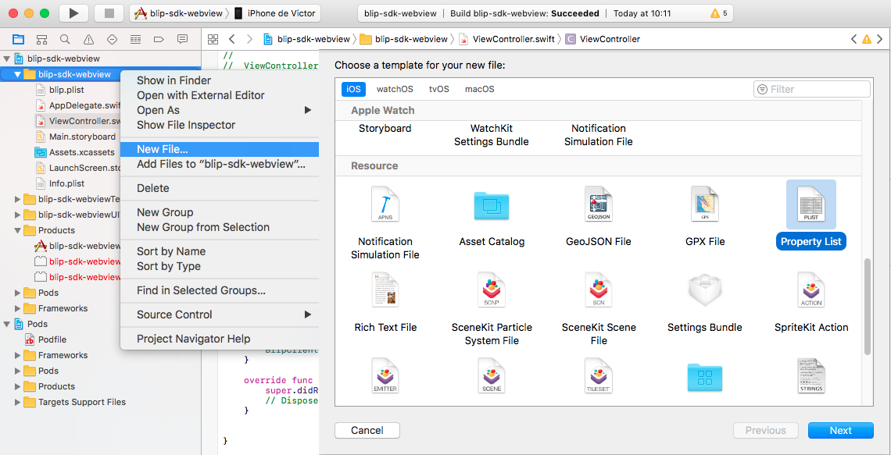

Blip SDK for iOS
======

SDK to easily add BLiP conversations in your iOS app. For more information see [BLiP portal][1] and [BLiP documentation][2].

Installation
--------

### Prerequisites

To use the Blip SDK for iOS, you must target iOS 8 or later.

Import the Blip SDK for iOS into your project via CocoaPods:

1. If you have not installed CocoaPods, install it by running the command:

		$ [sudo] gem install cocoapods
		$ pod setup

2. Create a plain text file named `Podfile` (without any file extension) inside your project directory. Add the lines below to your file and replace `YourTarget` with your actual target name.

		target 'YourTarget' do
		  use_frameworks!
		  pod "BlipSDK"
		end

3. Run the following command.

		$ pod install

4. Open up `*.xcworkspace` with Xcode and start using the SDK.

	**Note**: Do **NOT** use `*.xcodeproj`.  You receive an error if you open up a project file instead of a workspace.

How to use
-------------------------

## Quick start

### Setting your SDK

After include sdk reference on your project you must provide a valid **BLiP owner account**.
Only with this special account is possible to use this SDK.

__To get an owner account enter in contact with BLiP team.__

### After getting your owner account

1. Create a new plist file named **blip.plist** on your project.



2. Set your credentials, like bellow, on **blip.plist** file

	```xml
	<key>blipsdk.ownerIdentity</key>
	<string>your-valid-identity</string>
	<key>blipsdk.ownerPassword</key>
	<string>your-valid-password</string>
	```

###Opening a new Blip Conversation

1. Importing BlipSKD

	**Swift**
	```swift
	import BlipSDK
	```

	**Objective-C**

	```Objective-C
	#import "BlipSDK/BlipSDK-Swift.h"
	```

2. To open a new thread is very simple. Use **BlipClient** helper class and call *openBlipThread* method.

	**Swift**
	```swift
	BlipClient.openBlipThread(myView: self, recipientIdentifier: "your-chatbot-identifier")
	```

	**Objective-C**

	```Objective-C
	[BlipClient openBlipThreadWithMyView:self recipientIdentifier:@"your-chatbot-identifier"];
	```
	Obs: In Objective-C the method name is *openBlipThreadWithMyView*
	
	For instance, imagine that you want to establish a new conversation between your customer and your chatbot, when your ViewController is loaded.
	
	**Swift**
	```swift
	import UIKit
	import WebKit
	import BlipSDK

	class ViewController: UIViewController {

		override func viewDidLoad() {
			super.viewDidLoad()
		}

		override func viewDidAppear(_ animated: Bool) {
			BlipClient.openBlipThread(myView: self, recipientIdentifier: "testeblipcards")
		}

		override func didReceiveMemoryWarning() {
			super.didReceiveMemoryWarning()
			// Dispose of any resources that can be recreated.
		}
	}
	```

	**Objective-C**

	```Objective-C
	#import "ViewController.h"
	#import "BlipSDK/BlipSDK-Swift.h"

	@interface ViewController ()
	@end

	@implementation ViewController

	- (void)viewDidAppear:(BOOL)animated {
		[super viewDidAppear: animated];
		[BlipClient openBlipThreadWithMyView:self recipientIdentifier:@"testeblipcards"];
		// Do any additional setup after loading the view, typically from a nib.
	}

	- (void)didReceiveMemoryWarning {
		[super didReceiveMemoryWarning];
		// Dispose of any resources that can be recreated.
	}
	@end
	```

*To find your chatbot identifier go to [BLiP Portal](https://portal.blip.ai/#/application), select your chatbot and click 'Settings' on the left bar.

## Advanced features

### Setting information about your client

Sometimes, is very important that your chatbot knows information about your customers, as name or some external identifier for example.
To do this use *setUserAccount* method on **BlipClient** helper class.

**Swift**
```swift
let userAccount = BlipAccount()
userAccount.name = "your-customer-name"
userAccount.photoUri = "your-customer-photo-uri"
userAccount.externalId = "your-customer-id"
BlipClient.setUserAccount(userAccount: userAccount)
```

**Objective-C**

```Objective-C
BlipAccount *userAccount = [[BlipAccount alloc] init];
userAccount.name = @"your-customer-name";
userAccount.photoUri = @"your-customer-photo-uri";
userAccount.externalId = @"your-customer-id";
[BlipClient setUserAccountWithUserAccount:userAccount];
```

Obs: In Objective-C the method name is *setUserAccountWithUserAccount*

### Setting title for chat window 

In iOS you are able to set a title of the chat view. This title will be shown on the top of the ModalView.

**Swift**
```swift
BlipClient.setTitle(title: "My Chat")
```

**Objective-C**

```Objective-C
[BlipClient setTitleWithTitle:@"MyChat"];
```

Obs: In Objective-C the method name is *setTitleWithTitle*

For instance,

**Swift**
```swift
import UIKit
import WebKit
import BlipSDK

class ViewController: UIViewController {
	
	override func viewDidLoad() {
		super.viewDidLoad()
	}
	
	override func viewDidAppear(_ animated: Bool) {
		let userAccount = BlipAccount()
		userAccount.name = "Nome teste"
		userAccount.photoUri = "Uri teste"
		userAccount.externalId = "Id teste"
		BlipClient.setUserAccount(userAccount: userAccount)
		BlipClient.setTitle(title: "My Chat")
		BlipClient.openBlipThread(myView: self, recipientIdentifier: "testeblipcards")
	}
	
	override func didReceiveMemoryWarning() {
		super.didReceiveMemoryWarning()
		// Dispose of any resources that can be recreated.
	}
}
```

**Objective-C**

```Objective-C
#import "ViewController.h"
#import "BlipSDK/BlipSDK-Swift.h"


@interface ViewController ()
@end

@implementation ViewController

- (void)viewDidAppear:(BOOL)animated {
	[super viewDidAppear: animated];
	// Do any additional setup after loading the view, typically from a nib.
	BlipAccount *userAccount = [[BlipAccount alloc] init];
	userAccount.name = @"Nome teste";
	userAccount.photoUri = @"Uri teste";
	userAccount.externalId = @"Id teste";
	[BlipClient setUserAccountWithUserAccount:userAccount];
	[BlipClient setTitleWithTitle:@"MyChat"];
	[BlipClient openBlipThreadWithMyView:self recipientIdentifier:@"testeblipcards"];
}

- (void)didReceiveMemoryWarning {
	[super didReceiveMemoryWarning];
	// Dispose of any resources that can be recreated.
}

@end
```

Troubleshooting
-------

A -> **dyld: Library not loaded: @rpath/libswiftCore.dylib / Image not found**

Objective-C projects can present an error about library not loaded

If this occurs follow this steps:

1) Set your build setting variable *Runpath Search Paths* to **@executable_path/Frameworks**

your_target -> Build Settings -> Linking -> Runpath Search Paths

2) Switch build setting variable *Always Embed Swift Standard Libraries* to **Yes**

your_target -> Build Settings -> Build Options -> Always Embed Swift Standard Libraries

For a more detailed explanation see [this thread](http://stackoverflow.com/questions/26104975/dyld-library-not-loaded-rpath-libswiftcore-dylib-image-not-found) on stackoverflow

License
-------

	Licensed under the Apache License, Version 2.0 (the "License");
	you may not use this file except in compliance with the License.
	You may obtain a copy of the License at

	   http://www.apache.org/licenses/LICENSE-2.0

	Unless required by applicable law or agreed to in writing, software
	distributed under the License is distributed on an "AS IS" BASIS,
	WITHOUT WARRANTIES OR CONDITIONS OF ANY KIND, either express or implied.
	See the License for the specific language governing permissions and
	limitations under the License.


 [1]: https://blip.ai
 [2]: https://portal.blip.ai/#/docs/home
 [3]: http://search.maven.org/#search%7Cga%7C1%7Cg%3A%22net.take%22
 [snap]: https://oss.sonatype.org/content/repositories/snapshots/
